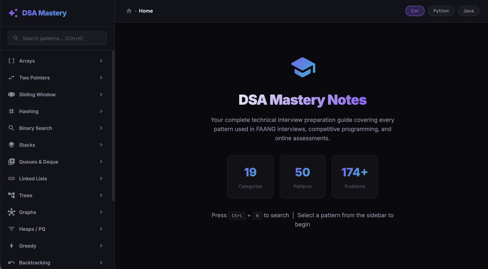
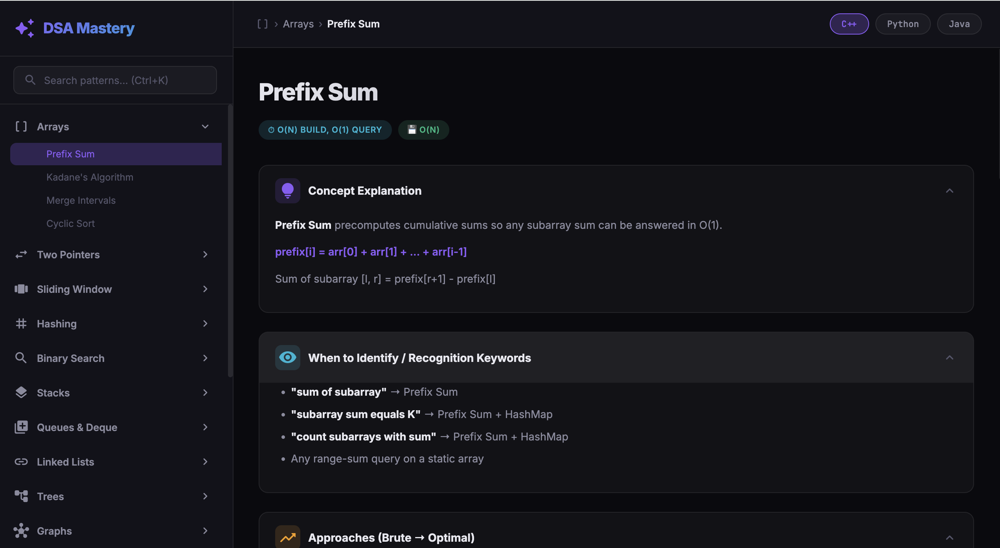

<div align="center">

# 🎓 DSA Mastery

### Complete Technical Interview Preparation Notes

[](LICENSE)
[](#-whats-covered)
[](#-whats-covered)
[](#-features)

A beautiful, interactive web app covering **every DSA pattern** used in FAANG interviews, competitive programming, and online assessments — with template code in C++, Python, and Java.

</div>

---

## 📸 Screenshots





---

## ✨ Features

- 🌙 **Dark glassmorphic UI** — premium design with smooth animations
- 📂 **19 categories, 50+ patterns** — from basics to advanced
- 💻 **Template code in 3 languages** — C++, Python, Java with syntax highlighting
- 🔍 **Instant search** — press `Ctrl+K` to find any pattern
- 📋 **One-click copy** — copy code templates instantly
- 🏷️ **Complexity tags** — time & space complexity at a glance
- 📝 **Dry run examples** — step-by-step walkthroughs with tables
- ⚠️ **Common mistakes & edge cases** — avoid interview pitfalls
- 🧠 **Recognition keywords** — "if you see X, think Y"
- 🎯 **174+ LeetCode problems** — Easy → Medium → Hard with direct links
- 📱 **Responsive** — works on desktop and mobile

---

## 📚 What's Covered

| Category | Patterns |
|---|---|
| **Arrays** | Prefix Sum, Kadane's Algorithm, Merge Intervals, Cyclic Sort |
| **Two Pointers** | Opposite Direction, Same Direction, Fast-Slow Pointer, Partitioning (DNF) |
| **Sliding Window** | Fixed Size, Variable Size, Exactly K (AtMost Trick) |
| **Hashing** | Frequency Map, HashSet Optimization |
| **Binary Search** | Standard, Lower/Upper Bound, Search on Answer |
| **Stacks** | Monotonic Stack, Parentheses / Expression Evaluation |
| **Queues & Deque** | Monotonic Deque, BFS Queue |
| **Linked Lists** | Reverse, Fast-Slow Pointer, Merge |
| **Trees** | DFS Traversals, Level Order BFS, Diameter & LCA |
| **Graphs** | BFS/DFS, Topological Sort, Union Find, Dijkstra |
| **Heaps / PQ** | Top K, K-Way Merge |
| **Greedy** | Interval Scheduling, General Strategies |
| **Backtracking** | Subsets, Combinations, Permutations |
| **Dynamic Programming** | Fibonacci, Knapsack, LIS, LCS, Grid, Interval, Bitmask, State Machine DP |
| **Bit Manipulation** | XOR Tricks, Set/Clear Bits |
| **Trie** | Prefix Tree with Insert/Search/StartsWith |
| **Segment & Fenwick Tree** | Range Queries, Point Updates |
| **String Algorithms** | KMP, Rabin-Karp / Rolling Hash |
| **Advanced** | Meet in the Middle, Sweep Line, Sparse Table |

---

## 🚀 Getting Started

### Prerequisites

- [Node.js](https://nodejs.org/) (v18+)

### Installation

```bash
git clone https://github.com/Mahizhan-S/DSA_Notes.git
cd DSA_Notes
npm install
```

### Run

```bash
./run.sh            # Start the dev server
./run.sh stop       # Stop the server
./run.sh restart    # Restart the server
```

Or manually:

```bash
npm run dev
```

Then open **http://localhost:5173** in your browser.

---

## 📁 Project Structure

```
DSA_Notes/
├── index.html              # Entry point
├── src/
│   ├── main.js             # App logic, navigation, search
│   ├── renderer.js         # Pattern content renderer
│   ├── style.css           # Complete design system
│   └── data/
│       ├── index.js        # Category registry
│       ├── arrays.js       # Array patterns
│       ├── twoPointers.js  # Two Pointer subtypes
│       ├── slidingWindow.js# Sliding Window subtypes
│       ├── dp.js           # Dynamic Programming patterns
│       ├── graphs.js       # Graph algorithms
│       └── ...             # 17 data modules total
├── run.sh                  # Start/stop script
├── LICENSE                 # MIT License
└── screenshots/            # App screenshots
```

---

## 🤝 Contributing

Contributions are welcome! Feel free to:

- Add new patterns or problems
- Improve explanations or dry runs
- Add more language templates
- Fix bugs or improve UI

---

## 📄 License

This project is licensed under the **MIT License** — see the [LICENSE](LICENSE) file for details.

---

<div align="center">

**Built for interview prep. Open source for everyone.**

⭐ Star this repo if it helps your preparation!

</div>
